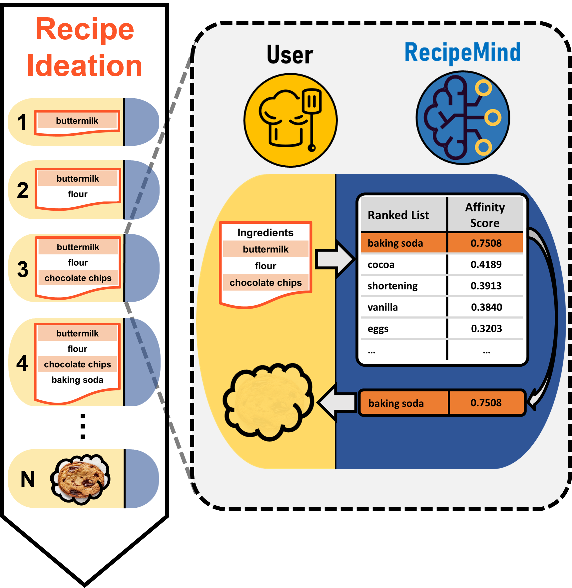
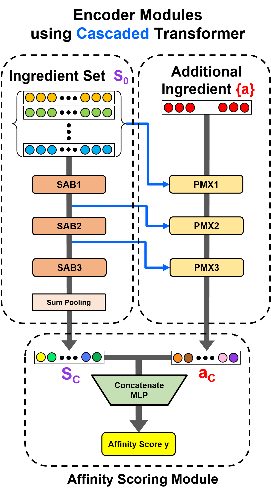
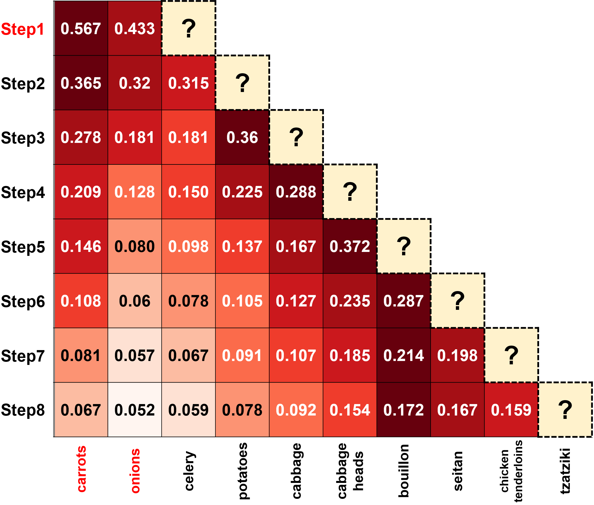
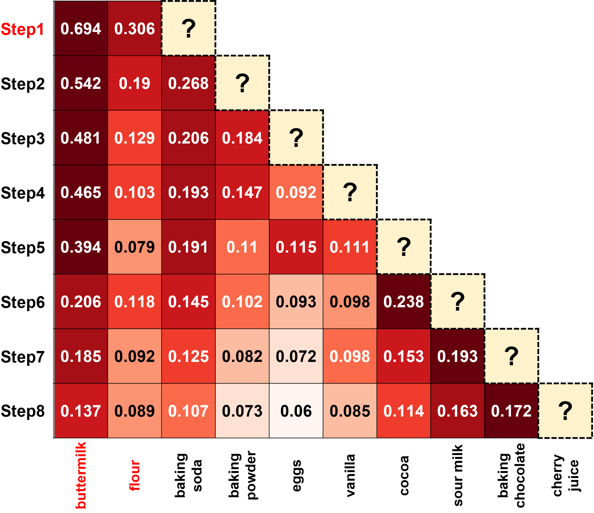

# RecipeMind: Guiding Ingredient Choices from Food Pairing to Recipe Completion using Cascaded Set Transformer

## Abstract

We propose a computational approach for recipe ideation, a down-stream task that helps users select and gather ingredients for creating dishes. To perform this task, we developed RecipeMind, a food affinity score prediction model that quantifies the suitability of adding an ingredient to set of other ingredients. We constructed a large-scale dataset containing ingredient co-occurrence based scores to train and evaluate RecipeMind on food affinity score prediction. Deployed in recipe ideation, RecipeMind helps the user expand an initial set of ingredients by suggesting additional ingredients. Experiments and qualitative analysis show RecipeMind’s potential in fulfilling its assistive role in cuisine domain.

## Overview of Recipe Ideation



## Overview of RecipeMind



## Prerequisites for running RecipeMind

- Python 3.8.12
- CUDA: 11.X
- Download and extract data.tar.gz ([link](https://drive.google.com/file/d/1xZa4fPQvoxWBX_fvcFtmZjWZj0Fa7pFj/view?usp=sharing), 388.4MB) at directory **./data**. These files are the datasets containing ingredient n-tuplets with food affinity scores and ingredient word embeddings.
- Download and extract saved.tar.gz ([link](https://drive.google.com/file/d/1D_PQcf82-0b4qW3EUGQWV_cQnKezt2Yc/view?usp=sharing), 115.3MB) at directory **./saved**. These files are the model checkpoints for each random seed (1001 ~ 1005).

## Installing the Python (3.8.12) Conda Environment

```
conda env create -f recipemind.yml
conda activate recipemind
```

## Training RecipeMind

Run the following code,
```
./train_script.sh {your_session_name} {random_seed_integer}
```

## Testing RecipeMind in all ingredient set sizes from 2 to 7

Run the following code,
```
./test_script.sh {your_session_name} {random_seed_integer}
```

## Analyzing RecipeMind

The jupyter notebook **RecipeMind Post Analysis.ipynb** contains the source code for deploying the trained RecipeModel model in recipe ideation scenarios starting with any number of ingredients. We provided example cells that output the ideation results and attention heatmaps for interpretation purposes. The example heatmaps are the following,

### Case Study 1: Starting with Carrots and Onions



### Case Study 2: Starting with Buttermilk and Flour




## Contributors

<table>
	<tr>
		<th>Name</th>		
		<th>Affiliation</th>
		<th>Email</th>
	</tr>
	<tr>
		<td>Mogan Gim&dagger;</td>		
		<td>Data Mining and Information Systems Lab,<br>Korea University, Seoul, South Korea</td>
		<td>akim@korea.ac.kr</td>
	</tr>
	<tr>
		<td>Donghee Choi&dagger;</td>		
		<td>Data Mining and Information Systems Lab,<br>Korea University, Seoul, South Korea</td>
		<td>choidonghee@korea.ac.kr</td>
	</tr>
	<tr>
		<td>Kana Maruyama</td>		
		<td>Sony AI, Tokyo, Japan</td>
		<td>Kana.Maruyama@sony.com</td>
	</tr>
	<tr>
		<td>Jihun Choi</td>		
		<td>Sony AI, Tokyo, Japan</td>
		<td>Jihun.A.Choi@sony.com</td>
	</tr>
	<tr>
		<td>Donghyeon Park*</td>		
		<td>Food & Nutrition AI Lab,<br>Sejong University, Seoul, South Korea</td>
		<td>parkdh@sejong.ac.kr</td>
	</tr>
	<tr>
		<td>Jaewoo Kang*</td>		
		<td>Data Mining and Information Systems Lab,<br>Korea University, Seoul, South Korea</td>
		<td>kangj@korea.ac.kr</td>
	</tr>

</table>


- &dagger;: *Equal Contributors*
- &ast;: *Corresponding Authors*

## Citation
```bibtex
@inproceedings{gim2022recipemind,
  title={RecipeMind: Guiding Ingredient Choices from Food Pairing to Recipe Completion using Cascaded Set Transformer},
  author={Gim, Mogan and Choi, Donghee and Maruyama, Kana and Choi, Jihun and Kim, Hajung and Park, Donghyeon and Kang, Jaewoo},
  booktitle={Proceedings of the 31st ACM International Conference on Information \& Knowledge Management},
  pages={3092--3102},
  year={2022}
}
```


